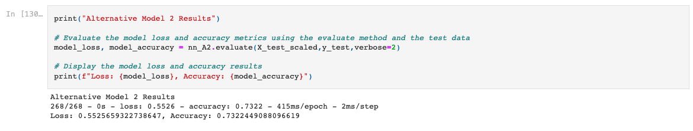

# VC_Risk_Model_Neural_Network
The design and optimization of a neural network used to identify whether a VC firm should fund businesses

---

## Technologies

This application is written in Python v. 3.9.7 and uses [JupyterLab](https://jupyter.org/) to deploy the code. This application makes use of
 the following libraries:


[pandas](https://pandas.pydata.org/docs/) was used for data collection, preparation, and analysis

[pathlib](https://docs.python.org/3/library/pathlib.html) was used to assist in importing and exporting data

[sklearn](https://scikit-learn.org/stable/) was used for preparing and scaling data to be used for the neural network modeling and fitting

[tensorflow](https://github.com/tensorflow/docs) was used for creating neural network models

---

## Installation Guide

Prior to running this application, perform the following in the command line to install the required libraries:

`pip install pandas`

`pip install jupyterlab`

`pip install pathlib`

`pip install sklearn`

`pip install tensorflow`


---

## Usage

In order to launch the application, navigate to the VC_Risk_Model_Neural_Network folder that contains all of the code for this application, and then type into the command line:

```
jupyter lab
```

Once in jupyter lab, open the venture_funding_with_deep_learning.ipynb and run each cell in the jupyter file to see the resulting anlysis.

Below is an example output of running one of the cells:



---

## Contributors

Robby Odum

Email: rodum012@gmail.com

---

## License

MIT